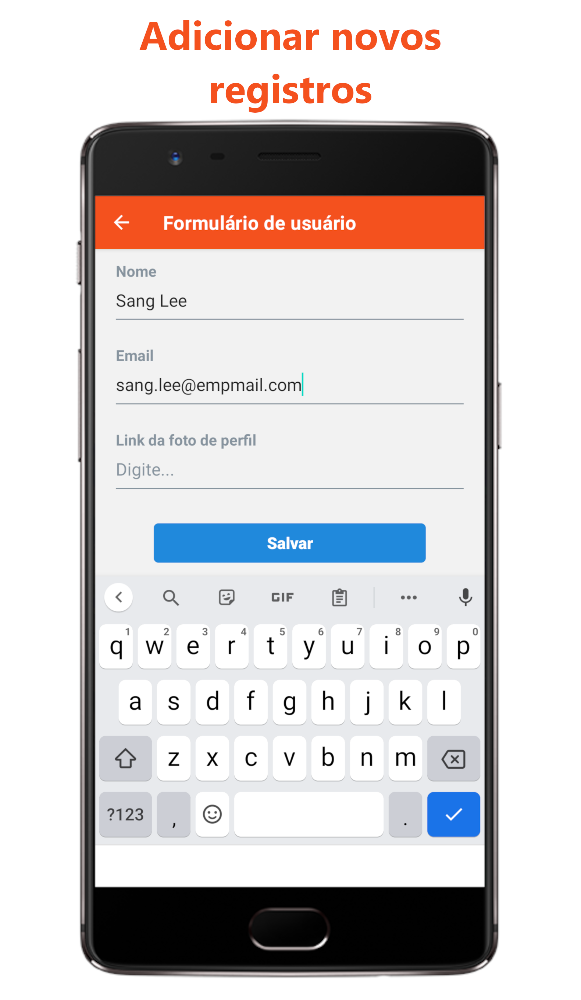

# Aplicativo de Gerenciamento de usuários

A ideia desse aplicativo, desenvolvido com [React Native](https://reactnative.dev), é explorar o uso de [Hooks](https://www.bacancytechnology.com/blog/react-native-hooks-to-build-app) e da [API Context](https://www.loginradius.com/blog/async/react-context-api/) para gerenciar o estado dos componentes de forma global, sem a necessidade de passar o estado entre os componentes de forma direta (através de *props*) ou indireta (através de funções), o que é inviável em aplicações mais complexas.

Esse app exibe uma lista de usuários *default*, salva em uma classe, e o usuário do aplicativo pode realizar as 4 operações básicas nos elementos da lista, que são conhecidas pelo acrônimo **CRUD**:

* **C**reate
* **R**ead
* **U**pdate
* **D**elete

### As 4 operações básicas em uma lista de elementos

### Download

[Clique aqui para baixar a versão para Android.](https://github.com/fabioTowers/react_native_crud/releases/download/v1.0.0/gerenciamento_de_lista.apk)

Você também pode testar o aplicativo através da plataforma [Expo](https://expo.dev) se tiver o aplicativo [Expo Go](https://play.google.com/store/apps/details?id=host.exp.exponent&hl=pt_BR&gl=US) instalado em seu *smartphone*. Basta abrir o Expo Go e escanear o QR Code disponível [nesse link](https://expo.dev/@fabiotowers/gerenciamento_de_lista) ou abrindo [este outro link](exp://exp.host/@fabiotowers/gerenciamento_de_lista?release-channel=default) em seu dispositivo móvel.

---

### Sobre o desenvolvedor

[**Veja meu perfil no Medium**](https://medium.com/@fabiomendes_95615)

[**Veja meu perfil no LinkedIn**](https://www.linkedin.com/in/fabio-mendes-35743b128)
